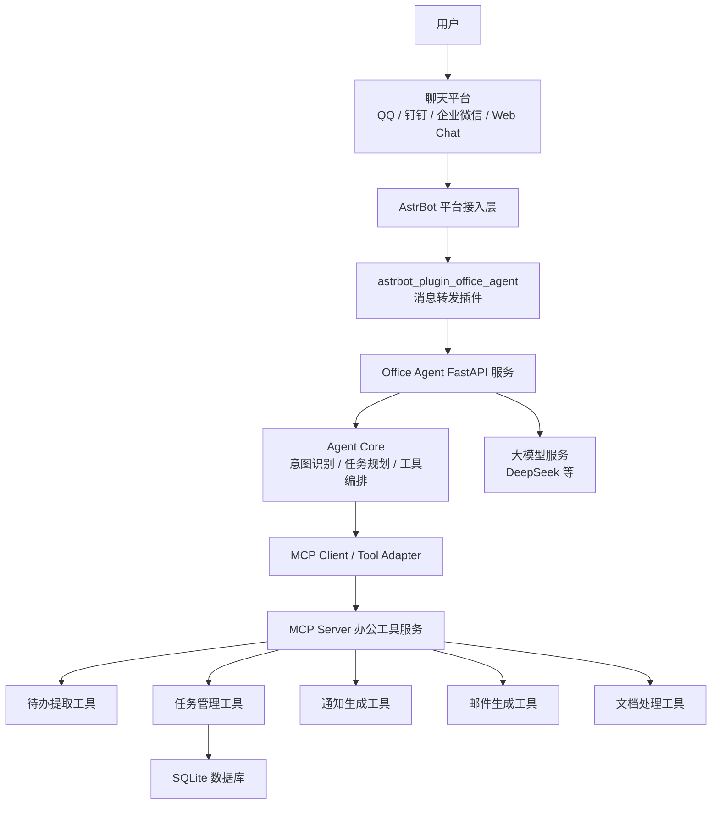
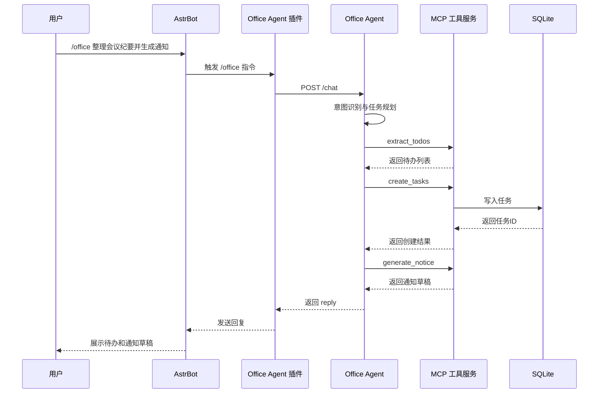

# MCP驱动的多平台办公协同智能体系统设计与实现

## 一、项目概述

### 1.1 项目名称

**MCP驱动的多平台办公协同智能体系统设计与实现**

### 1.2 项目定位

本项目面向真实办公场景，设计并实现一个基于 **AstrBot + MCP + 自研 Office Agent** 的多平台办公协同智能体系统。系统通过 AstrBot 接入聊天平台，通过 MCP 协议封装办公工具能力，并由自研 Agent 负责任务理解、流程规划、工具编排、上下文管理和结果确认。

本项目不是普通聊天机器人，而是一个能够处理办公流程的智能体系统。用户可以在聊天窗口中发起办公任务，例如整理会议纪要、提取待办、生成通知、生成邮件、处理文档等，系统能够自动理解任务目标，调用对应工具，并返回结构化结果。

### 1.3 当前实现状态

目前项目已经完成以下核心链路：

```text
用户聊天输入
↓
AstrBot 平台入口
↓
自研 AstrBot 插件 astrbot_plugin_office_agent
↓
Office Agent FastAPI 服务
↓
Agent Core 意图识别与流程编排
↓
MCP 工具服务
↓
待办提取 / 任务创建 / 通知生成
↓
返回待办清单与通知草稿
```

当前已验证的演示指令：

```text
/office 请把会议纪要整理成待办并生成通知：张三周五前完成需求文档，李四下周一提交测试计划。
```

系统可返回：

```text
1. 完成需求文档（负责人：张三，截止时间：周五）
2. 提交测试计划（负责人：李四，截止时间：下周一）

通知草稿：
各位同事，以下是本次会议形成的待办事项，请相关负责人按时推进……
```

### 1.4 当前补强进展

根据赛前评审意见，当前版本已进一步补强以下内容：

- 引入多角色 Agent 协同结构：`CoordinatorAgent`、`TaskAgent`、`WriterAgent`、`DocumentAgent`、`SafetyAgent`。
- 修正安全确认流程：确认前只生成待办预览和通知草稿，用户回复“确认”后才正式创建待办任务。
- 增加 AI 工具结构化待办抽取接口：配置模型 Key 后可优先使用 AI 工具输出结构化 JSON，未配置时使用规则工具兜底。
- 实现文档解析最小闭环：支持 `.docx`、`.pdf`、`.xlsx`、`.txt` 的文本提取入口。
- 补充自动化测试：覆盖 Planner 计划、确认流程、任务创建、文档解析等基础能力。

## 二、项目背景与问题分析

### 2.1 办公场景痛点

在实际办公场景中，用户经常需要在多个系统之间切换，例如：

- 钉钉、企业微信、QQ 等即时通讯平台
- 邮箱系统
- Word、Excel、PDF、PPT 等办公文档
- 任务管理系统
- 日程与提醒系统

传统办公工具大多只能完成单点任务，例如只负责写邮件、总结文档或发送消息，缺少对完整办公流程的理解和编排能力。用户仍然需要手动复制内容、整理任务、生成通知、发送邮件和跟进进度，流程割裂、效率较低。

### 2.2 本项目解决的问题

本项目希望解决以下问题：

1. **多平台办公入口分散**
   用户可以直接在聊天平台中发起办公任务，不需要打开多个系统。

2. **办公任务缺乏流程化处理能力**
   系统不只回答问题，还能拆解任务、调用工具并生成结果。

3. **工具能力难以复用和扩展**
   通过 MCP 协议将办公能力封装为标准工具，便于后续扩展。

4. **办公结果缺少确认与安全控制**
   对发送邮件、群通知、创建正式任务等敏感操作进行用户确认。

5. **文档、任务和消息之间缺少协同**
   系统可将会议纪要、待办事项、通知文本和任务记录串联成完整闭环。

## 三、项目建设目标

### 3.1 总体目标

构建一个可以演示、可以部署、可以继续扩展的办公协同智能体原型系统，实现从聊天平台输入到办公任务处理的完整流程。

### 3.2 功能目标

系统计划支持以下能力：

| 功能方向 | 说明 |
|---|---|
| 办公问答 | 支持常见办公知识问答、上下文对话 |
| 文档处理 | 支持 Word、PDF、Excel 等文档读取、总结、重点提取 |
| 会议纪要处理 | 从会议纪要中提取待办、负责人和截止时间 |
| 办公文本生成 | 生成通知、邮件、周报、报告初稿 |
| 任务管理 | 创建待办、查询任务状态、记录进度 |
| 平台交互 | 通过 AstrBot 接入聊天平台 |
| MCP 工具调用 | 通过 MCP 标准化封装和调用办公工具 |
| 用户确认 | 对发送通知、邮件等操作进行二次确认 |

### 3.3 第一阶段 MVP 目标

第一阶段重点完成一个高价值办公闭环：

```text
会议纪要 / 聊天文本
↓
提取待办
↓
创建任务记录
↓
生成通知草稿
↓
等待用户确认
```

目前该 MVP 流程已经实现并通过 AstrBot 聊天界面验证。

## 四、总体系统架构

### 4.1 架构设计思路

系统采用分层架构，将平台入口、Agent 编排、MCP 工具、办公能力和数据存储分离，降低耦合度，便于后续扩展。



### 4.2 架构分层说明

| 层级 | 组成 | 职责 |
|---|---|---|
| 平台接入层 | AstrBot | 接收聊天平台消息，负责多平台入口 |
| 插件桥接层 | astrbot_plugin_office_agent | 将 AstrBot 消息转发至 Office Agent |
| Agent 服务层 | FastAPI + Office Agent Core | 对外提供 `/chat` 接口，负责任务调度 |
| Agent 编排层 | Planner / Memory / Tool Executor | 意图识别、任务拆解、工具调用、上下文记忆 |
| MCP 工具层 | MCP Server / FastMCP | 将办公工具能力标准化封装 |
| 办公能力层 | 文档、待办、通知、邮件工具 | 执行具体办公任务 |
| 数据存储层 | SQLite | 保存任务、日志、上下文等数据 |

## 五、核心模块设计

### 5.1 AstrBot 平台接入层

AstrBot 负责接入聊天平台，为系统提供统一消息入口。用户可以通过 AstrBot 支持的平台与系统交互。

当前已使用 AstrBot Docker 方式部署，并已完成：

- AstrBot Web 管理后台配置
- MCP Server 添加与测试
- 插件上传安装
- 聊天界面调用 Office Agent

### 5.2 自研 AstrBot 插件

项目实现了自研插件：

```text
astrbot_plugin_office_agent
```

插件作用：

```text
AstrBot 消息
↓
插件捕获 /office 指令
↓
构造标准请求体
↓
POST 到 Office Agent /chat
↓
将 Agent 返回结果发送回聊天窗口
```

插件支持指令：

```text
/office 办公任务内容
/oa 办公任务内容
/办公 办公任务内容
/office_ping
```

插件请求格式示例：

```json
{
  "platform": "astrbot",
  "user_id": "用户ID",
  "session_id": "会话ID",
  "group_id": "群ID",
  "message_id": "消息ID",
  "content": "用户输入的办公任务"
}
```

插件配置项包括：

| 配置项 | 说明 |
|---|---|
| `agent_url` | Office Agent `/chat` 接口地址 |
| `timeout_seconds` | 请求超时时间 |
| `max_reply_chars` | 最大回复长度 |
| `auto_forward` | 是否自动转发消息 |
| `only_wake` | 自动转发时是否只处理唤醒消息 |
| `stop_event` | 回复后是否阻止后续插件继续处理 |

### 5.3 Office Agent FastAPI 服务

Office Agent 服务是系统的核心后端，当前已实现：

| 接口 | 方法 | 功能 |
|---|---|---|
| `/health` | GET | 健康检查 |
| `/chat` | POST | 接收用户消息并返回 Agent 处理结果 |

健康检查返回：

```json
{
  "status": "ok",
  "service": "office-agent"
}
```

`/chat` 接口返回示例：

```json
{
  "session_id": "s001",
  "reply": "已提取出以下待办……",
  "intent": "meeting_todos_and_notice",
  "need_confirmation": true,
  "tool_results": []
}
```

### 5.4 Agent Core 主控模块

Agent Core 是项目核心，负责把用户自然语言请求转换为可执行办公流程。

主要组成：

| 子模块 | 功能 |
|---|---|
| `IntentPlanner` | 识别用户意图，生成执行计划 |
| `MemoryStore` | 保存会话级上下文、待确认动作、最近文件 |
| `ToolExecutor` | 调用 MCP 工具 |
| `ResponseBuilder` | 整理工具结果并生成回复 |

当前支持的意图包括：

| 意图 | 说明 |
|---|---|
| `meeting_todos_and_notice` | 会议纪要转待办并生成通知 |
| `extract_todos` | 提取待办 |
| `generate_email` | 生成邮件草稿 |
| `summarize_document` | 总结文档 |
| `query_task_status` | 查询任务状态 |
| `office_qa` | 办公问答 |

### 5.5 上下文记忆模块

当前系统已实现会话级短期记忆，主要包括：

```text
pending_action   等待用户确认的操作
last_file_path   最近引用或上传的文件路径
history          当前会话历史消息
```

该设计可以支持多轮流程，例如：

```text
用户：帮我整理会议纪要并生成通知
系统：已生成通知草稿，是否确认执行？
用户：确认
系统：识别该确认对应上一轮待执行动作
```

当前记忆为内存级别，服务重启后会丢失。后续计划将确认记录、历史任务、用户偏好写入 SQLite，实现持久化长期记忆。

### 5.6 MCP 工具服务模块

项目已实现 MCP Server，并已在 AstrBot MCP 页面测试成功。

已识别工具包括：

```text
summarize_document_tool
extract_todos_tool
create_tasks_tool
query_task_status_tool
generate_notice_tool
generate_email_tool
```

当前工具说明：

| MCP 工具 | 功能 |
|---|---|
| `extract_todos_tool` | 从会议纪要或聊天内容中提取待办 |
| `create_tasks_tool` | 将待办写入 SQLite 任务表 |
| `query_task_status_tool` | 查询任务状态 |
| `generate_notice_tool` | 根据待办生成群通知草稿 |
| `generate_email_tool` | 根据用户输入生成邮件草稿 |
| `summarize_document_tool` | 已实现文档总结能力接口 |

当前 `summarize_document_tool` 已从占位接口升级为文档文本提取与摘要入口，支持 `.docx`、`.pdf`、`.xlsx` 和 `.txt` 文件。后续将继续接入 AI 工具摘要与“文档转待办”增强逻辑。

MCP 工具统一返回结构：

```json
{
  "success": true,
  "tool_name": "extract_todos",
  "data": {},
  "message": "ok",
  "error": null
}
```

### 5.7 任务管理模块

系统使用 SQLite 存储待办任务，当前已实现任务创建和任务查询。

任务表结构：

```sql
CREATE TABLE IF NOT EXISTS tasks (
    id INTEGER PRIMARY KEY AUTOINCREMENT,
    title TEXT NOT NULL,
    description TEXT,
    assignee TEXT,
    due_date TEXT,
    status TEXT DEFAULT 'pending',
    source_platform TEXT,
    source_user_id TEXT,
    source_group_id TEXT,
    created_at TEXT NOT NULL,
    updated_at TEXT NOT NULL
);
```

任务状态设计：

| 状态 | 说明 |
|---|---|
| `pending` | 待处理 |
| `in_progress` | 进行中 |
| `done` | 已完成 |
| `cancelled` | 已取消 |

## 六、系统关键业务流程

### 6.1 会议纪要转待办并生成通知



### 6.2 用户确认流程

敏感操作如发送邮件、发送群通知、正式创建任务等，系统设计为需要用户确认。

流程如下：

```text
Agent 生成执行结果
↓
判断是否涉及敏感操作
↓
返回草稿与待执行动作
↓
用户回复“确认”
↓
Agent 读取 pending_action
↓
执行后续动作
↓
记录日志
```

当前版本已实现待确认状态保存，后续将接入真实邮件发送或群消息发送能力。

当前补强后，任务创建也被纳入确认后执行流程：系统先展示待办和通知草稿，用户回复“确认”后才调用任务创建工具写入数据库。

## 七、部署与运行方案

### 7.1 当前部署环境

当前部署环境：

| 项目 | 说明 |
|---|---|
| 服务器面板 | 宝塔 |
| 操作系统 | Ubuntu |
| AstrBot 部署方式 | Docker |
| Office Agent 部署位置 | `/AstrBot/data/office-agent` |
| 插件部署位置 | `/AstrBot/data/plugins/astrbot_plugin_office_agent` |
| Agent 服务地址 | `http://127.0.0.1:8000` |
| MCP Server 模式 | Stdio 本地进程模式 |

### 7.2 Office Agent 启动方式

在 AstrBot Docker 容器内执行：

```bash
cd /AstrBot/data/office-agent
source .venv/bin/activate
nohup uvicorn app.main:app --host 127.0.0.1 --port 8000 > office-agent.log 2>&1 &
```

健康检查：

```bash
curl http://127.0.0.1:8000/health
```

### 7.3 MCP Server 配置

AstrBot MCP 配置：

```json
{
  "command": "/usr/bin/env",
  "args": [
    "PYTHONPATH=/AstrBot/data/office-agent",
    "DATABASE_PATH=/AstrBot/data/office-agent/data/office_agent.db",
    "/AstrBot/data/office-agent/.venv/bin/python",
    "-m",
    "app.mcp_server.server"
  ]
}
```

测试成功后 AstrBot 可识别 MCP 工具列表。

### 7.4 AstrBot 插件配置

插件配置文件：

```text
/AstrBot/data/config/astrbot_plugin_office_agent_config.json
```

推荐配置：

```json
{
  "agent_url": "http://127.0.0.1:8000/chat",
  "auth_token": "",
  "timeout_seconds": 60,
  "max_reply_chars": 4000,
  "auto_forward": false,
  "only_wake": true,
  "stop_event": true,
  "ignored_prefixes": "/,/plugin,/help"
}
```

## 八、测试与验证情况

### 8.1 FastAPI 服务验证

测试命令：

```bash
curl http://127.0.0.1:8000/health
```

结果：

```json
{
  "status": "ok",
  "service": "office-agent"
}
```

### 8.2 MCP Server 验证

在 AstrBot MCP 页面测试连接成功，识别到工具：

```text
summarize_document_tool
extract_todos_tool
create_tasks_tool
query_task_status_tool
generate_notice_tool
generate_email_tool
```

### 8.3 AstrBot 插件验证

测试指令：

```text
/office_ping
```

返回：

```text
Office Agent 连接正常：{'status': 'ok', 'service': 'office-agent'}
```

### 8.4 端到端流程验证

测试输入：

```text
/office 请把会议纪要整理成待办并生成通知：张三周五前完成需求文档，李四下周一提交测试计划。
```

系统输出：

```text
已提取出以下待办：

1. 完成需求文档（负责人：张三，截止时间：周五）
2. 提交测试计划（负责人：李四，截止时间：下周一）

通知草稿：
各位同事，以下是本次会议形成的待办事项，请相关负责人按时推进……
```

说明端到端链路已打通。

## 九、项目创新点

### 9.1 MCP 工具协议化封装

项目将办公能力拆解为多个 MCP 工具，使工具能力标准化、模块化、可复用。后续新增文档处理、邮件发送、日程提醒等能力时，只需增加新的 MCP 工具，不需要重写整体系统。

### 9.2 AstrBot 多平台接入

借助 AstrBot，系统可以快速接入 QQ、钉钉、企业微信等平台，降低多平台消息适配成本。

### 9.3 自研 Agent 编排核心

系统不是简单调用大模型，而是通过 Agent Core 完成：

```text
意图识别
任务拆解
工具选择
上下文记忆
结果组织
用户确认
```

这使系统具备办公流程处理能力。

### 9.4 文档、任务、通知协同

系统可以把会议纪要内容转化为待办任务，并进一步生成通知文本，实现从内容理解到任务执行的流程闭环。

### 9.5 安全可控执行机制

对于发送通知、邮件、创建正式任务等操作，系统设计了用户确认机制，降低误操作风险。

## 十、后续扩展方向

### 10.1 多角色 Agent 协同

后续可将当前 Office Agent 升级为多 Agent 协同系统：

| Agent 角色 | 职责 |
|---|---|
| `CoordinatorAgent` | 主控协调、任务拆解、选择子 Agent |
| `DocumentAgent` | 文档解析、摘要、重点提取 |
| `TaskAgent` | 待办提取、任务创建、进度查询 |
| `WriterAgent` | 通知、邮件、周报、报告生成 |
| `MailAgent` | 邮件发送、附件处理 |
| `SafetyAgent` | 敏感操作确认、权限检查 |

升级后的流程：

```text
用户请求
↓
CoordinatorAgent
↓
DocumentAgent / TaskAgent / WriterAgent / MailAgent
↓
SafetyAgent 审核
↓
工具执行
↓
结果返回
```

### 10.2 长期记忆与用户偏好

后续计划将短期内存记忆升级为长期记忆：

- 常用收件人
- 常用通知格式
- 用户所属部门
- 历史任务
- 历史会议纪要
- 常用报告模板

### 10.3 真实邮件与群通知发送

当前已具备通知草稿生成能力，后续将接入已有邮件插件或平台消息发送能力，实现：

```text
生成草稿
↓
用户确认
↓
发送邮件 / 群通知
↓
记录操作日志
```

### 10.4 文档上传处理

后续将进一步接入 Office 助手能力，实现：

- Word 文档读取
- PDF 摘要
- Excel 数据分析
- PPT 生成
- 文档内容转待办

### 10.5 服务常驻与运维优化

当前 Agent 服务通过 `nohup uvicorn` 启动，后续可优化为：

- Docker Compose 部署
- Supervisor 进程管理
- systemd 服务管理
- 日志轮转
- 健康检查与自动重启

## 十一、当前项目目录结构

当前核心项目目录：

```text
office-agent/
├── app/
│   ├── main.py
│   ├── config.py
│   ├── agent/
│   │   ├── core.py
│   │   ├── planner.py
│   │   ├── memory.py
│   │   └── prompts.py
│   ├── mcp_client/
│   │   └── client.py
│   ├── mcp_server/
│   │   ├── server.py
│   │   └── tools/
│   │       ├── document_tools.py
│   │       ├── task_tools.py
│   │       └── text_tools.py
│   ├── services/
│   │   ├── llm_service.py
│   │   ├── task_service.py
│   │   ├── document_service.py
│   │   └── platform_service.py
│   ├── database/
│   │   ├── db.py
│   │   └── models.py
│   └── schemas/
│       ├── message.py
│       ├── task.py
│       └── tool.py
├── data/
│   ├── files/
│   └── office_agent.db
├── docs/
├── tests/
├── requirements.txt
└── README.md
```

AstrBot 插件目录：

```text
astrbot_plugin_office_agent/
├── main.py
├── _conf_schema.json
├── metadata.yaml
├── requirements.txt
└── README.md
```

## 十二、总结

本项目围绕“办公场景中的多平台协同与流程自动化”展开，采用 AstrBot 作为多平台入口，MCP 作为工具调用协议，自研 Office Agent 作为智能编排核心，构建了一个可运行的办公协同智能体系统原型。

目前系统已经完成：

- AstrBot 与自研 Agent 的消息桥接
- Office Agent FastAPI 服务
- MCP Server 工具服务
- 待办提取、任务创建、通知生成工具
- SQLite 任务存储
- 聊天窗口端到端演示流程

项目已经具备“系统设计与实现”的基本形态，不再停留于理论方案，而是形成了可以部署、可以测试、可以演示的办公智能体原型。后续将重点完善真实邮件发送、文档处理、多 Agent 协同、长期记忆和权限控制，使系统逐步从 MVP 原型升级为完整的多平台办公协同智能体系统。
